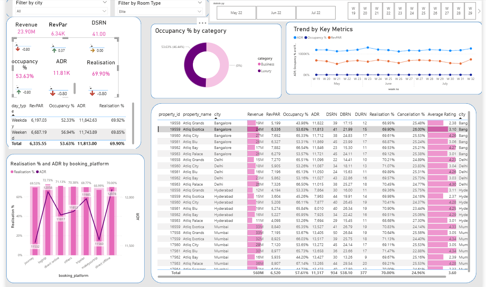

#  Sales & Financial Performance Dashboard

##  Project Overview
This is my first comprehensive Power BI project. I transformed raw business data into an interactive dashboard to help stakeholders track revenue trends, profit margins, and regional performance. 

##  Technical Process
* **Data Cleaning (ETL):** Used Power Query to remove duplicates, fix date formats, and handle missing values.
* **Data Modeling:** Built a relational model (Star Schema) to connect different tables for seamless filtering.
* **DAX Formulas:** Created custom measures to calculate key metrics like Total Sales and Profit %.
* **Visualization:** Designed a user-friendly interface using a professional 2024 theme.

##  Key Insights
* **Revenue Drivers:** Identified which product categories generate 80% of total profit.
* **Regional Trends:** Found that certain regions have high sales but low profit due to shipping costs.
* **Time Analysis:** Spotted a 15% increase in sales during the final quarter of the year.

##  Dashboard Preview

##  How to View
1. **Quick View:** Open the `powerbi_project.pdf` in this repo to see the static dashboard.
2. **Full Interactive Version:** Download the `.pbix` file and open it in [Power BI Desktop](https://powerbi.microsoft.com/desktop/).
